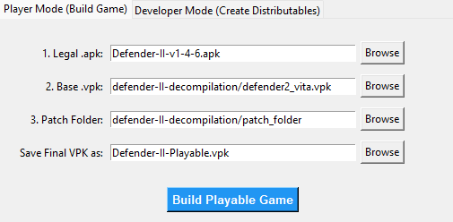
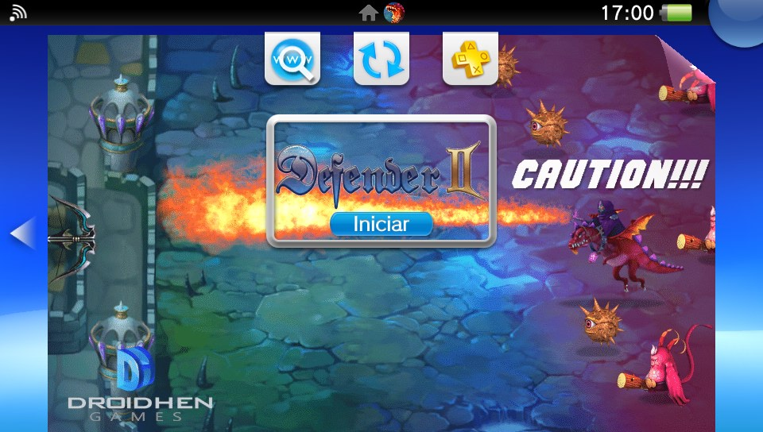
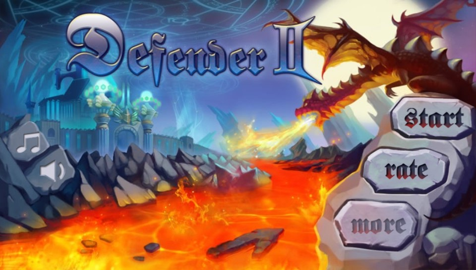
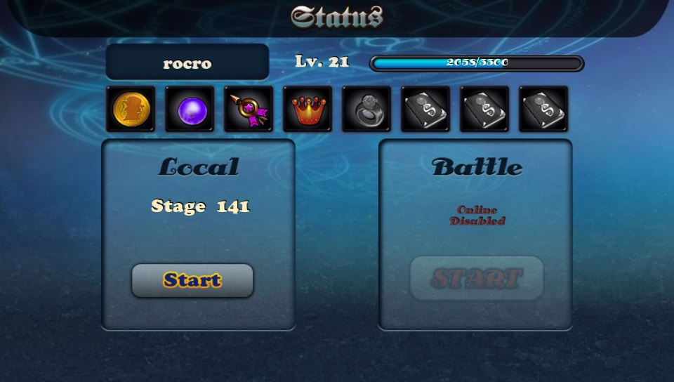
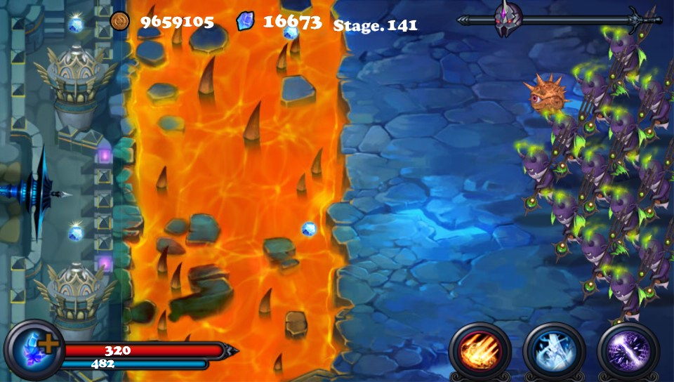
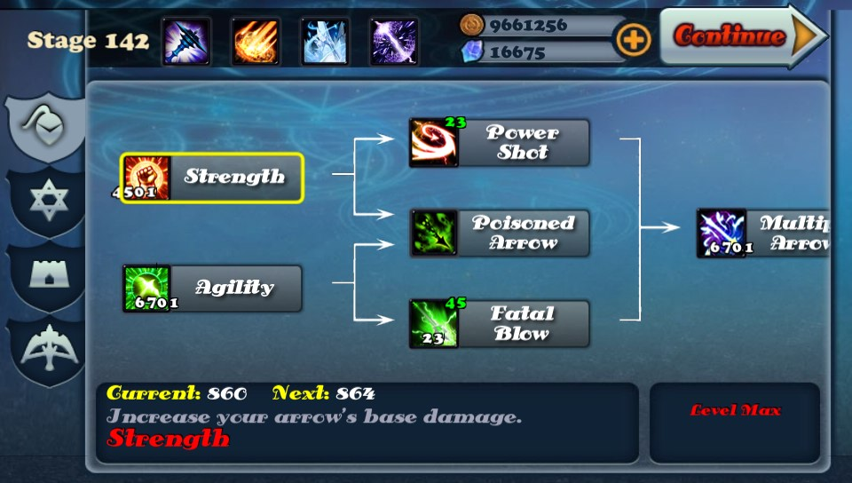

# Defender II PS Vita Port

Defender II is a pretty classic tower defense / castle defense game where you protect your castle from endless waves of enemies using a bow and powerful magic.

You play as the last defender, shooting arrows manually while upgrading your strength, speed, and abilities. As the game goes on, enemies become stronger and more challenging, so you’ll need to improve your skills and unlock new defenses like magic towers and special powers.

`app-c-cpp` contains the native C++/VitaGL port of Defender II for PS Vita. This is the Vita-specific side of the project: source code, packaging files, bundled Vita assets, and the helper script used to prepare the required game data.

> [!WARNING]
> This port was created as an experiment to evaluate how well LLMs can handle code translation between programming languages.
> AI was used primarily for code translation and initial integration, but the result has been manually reviewed and adjusted in many areas.
> Please be aware that there may still be unexpected issues or risks.

## Important

This repository does not ship the full original Android game data. To run the port, you must use your own legally obtained copy of Defender II for Android.

The supported Android release for this port is:

- `Defender II` version `1.4.6`

Official store page:

- [DEFENDER II on Google Play](https://play.google.com/store/apps/details?id=com.droidhen.defender2&hl=es)

## End-User Setup

1. Install the release `.vpk` from VitaDB or from the project's release package.
2. Obtain a legal copy of the `Defender II` Android APK, version `1.4.6`.
3. Run the patching tool with Python 3:

```bash
python apk_patcher.py
```

4. Use the tool to prepare the game data from your APK.



5. Install the generated VPK, or copy the patched files into `ux0:/app/DDEF00001/`.

Expected final layout:

```text
└── ux0:app/DEEF0001/ 
                ├── assets/ 
                ├── sce_sys/ 
                └── eboot.bin
```

## Building From Source

To build the Vita port yourself, install [VitaSDK](https://github.com/vitasdk) first, then make sure the libraries referenced by `CMakeLists.txt` are available.

Core libraries linked by the project:

- [vitaGL](https://github.com/Rinnegatamante/vitaGL)
- [vitaShaRK](https://github.com/Rinnegatamante/vitaShaRK)
- [libmathneon](https://github.com/Rinnegatamante/math-neon)
- `png`
- `jpeg`
- `z`
- `stdc++`
- `m`
- `c`

Useful install commands for some third-party libraries:

```bash
# libmathneon
make install

# vitaShaRK
make install

```

After the dependencies are installed, build the project with:

```bash
mkdir build
cd build
cmake ..
make
```

The project is configured with the Vita title ID `DDEF00001`.

## Screenshots






